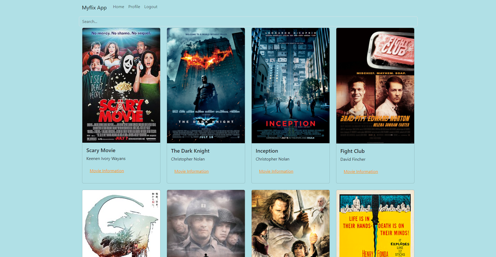
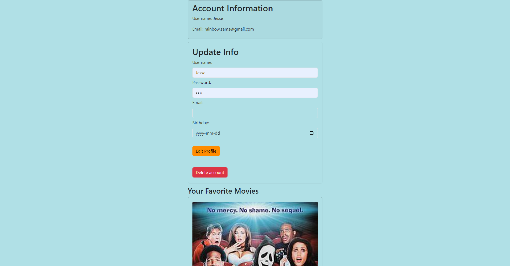

***

## MyFlix Movie Client App

***

***Overview***
MyFlix is a movie database application where users can browse through a collection of movies, view details about each movie, sign up, log in, and manage their personal profiles. Users can add or remove movies from their list of favorites, and the app provides a search function to filter through the available movie titles. The app is built using React, Redux for state management, and Bootstrap for styling.

***Features***

 1. User authentication (Login, Signup)
 2. Browse and search through a movie list
 3. View information about a selected movie
 4. Add or remove movies from your favorites
 5. Manage your user profile

***Tech Stack***

 1. Frontend: React.js, React Router
 2. State Management: Redux, Redux Toolkit
 3. Styling: Bootstrap, SCSS
 4. Backend: MyFlix API
 5. Routing: React Router DOM

***Site Images***

**Home Page**

**Profile Page**

 

Link to App: https://myflixfm.netlify.app/

***Folder Structure Breakdown***

 1. components/: Contains all reusable UI components.
 2. main-view/: The main view of the app, routing between different
     views like the movie list and profile view.
 3. login-view/, signup-view/: Handles user authentication.
 4. movies-list/, movies-filter/: Displays and filters movies.
 5. profile-view/: Allows users to manage their profiles and favorite
    movies.
 6. redux/: Manages global state using Redux.
 7. reducers/movies.js: Handles the movies and filter states.
 8. store.js: Configures and exports the Redux store.

***If You Wish To Contribute***

Please feel free to contribute! just fork this repository and make a pull request.

***License***

This project is licensed under the MIT License.
